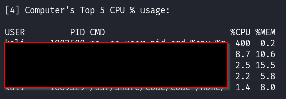

# InfoGetter  
A Bash CLI script for linux to automate some checks, like external + internal IP, MAC address, CPU and memory usage.  
Tested on Kali Linux.  

## How to Use  
To run this script, type `bash info-getter.sh` in a linux terminal.  
  
  

## Contents  
1. Display your Public IP Address    

    

2. Display your Internal IP Address    

    

3. Display the Mac address of Machine (Censoring the 1st half)    

    

4. Display the Top 5 process’s CPU usage percentage    

    

5. Display Memory Usage, Total, Used and Free    

    

6. Display your active system services and their status    

    

7. Locate and display the top 10 files in size, in the "/home" directory    

 

